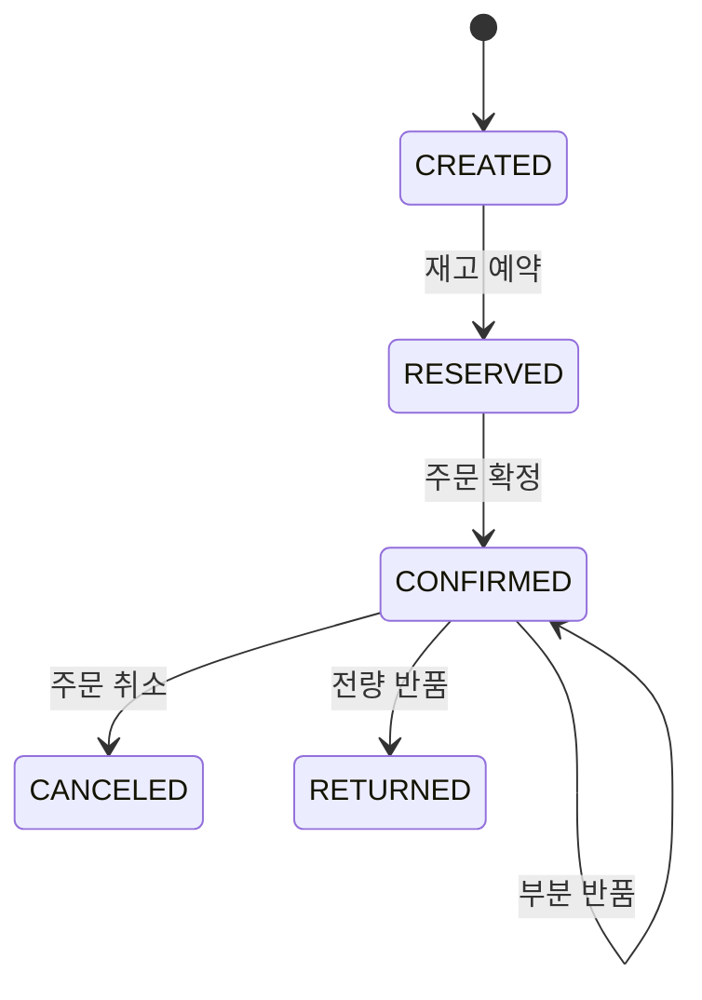

# InvMgmt

[](https://github.com/HwanDevBlog/InvMgmt/actions/workflows/backend-ci.yml)

주문 처리 과정에서 발생하는 재고 차감, 취소, 반품과 재고 원장의 정합성을 다루는 토이 프로젝트입니다.

단순 CRUD보다 다음 문제를 코드와 테스트로 확인하는 데 초점을 맞췄습니다.

- 같은 요청이 반복되어도 재고가 중복 차감되지 않는가
- 동시에 들어온 주문이 같은 재고를 덮어쓰지 않는가
- 취소와 부분 반품 후 현재고가 정확히 복원되는가
- 현재고와 재고 원장의 합계가 일치하는가

## 구현 범위

- 상품 등록·조회·수정
- 상품별 현재고 조회
- 주문 생성·조회
- 주문 재고 예약·확정·취소
- 주문 상품 부분 반품과 전체 반품
- 멱등키를 이용한 중복 요청 방지
- 낙관적 락과 비관적 락 기반 동시성 제어
- 현재고와 재고 원장의 정합성 대사
- OpenAPI 문서와 Swagger UI
- GitHub Actions 백엔드 테스트

## 핵심 설계

### 현재고와 재고 원장

`Stock`은 빠른 조회를 위한 현재 수량을 보관하고, `StockLedger`는 재고가 변한 이유와 증감량을 기록합니다. 재고 수량을 일반 수정 API로 직접 덮어쓰지 않고 주문 예약, 취소, 반품 같은 도메인 명령을 통해서만 변경합니다.

상품별로 다음 관계가 유지되는지 대사 API에서 확인합니다.

```text
현재고 = 재고 원장 증감량의 합
```

### 주문 상태 전이



허용되지 않은 상태에서 명령을 실행하면 비즈니스 충돌로 처리합니다. 부분 반품 중에는 `CONFIRMED` 상태를 유지하고 모든 수량이 반품된 시점에 `RETURNED`로 전환합니다.

### 중복 요청과 동시성

- 예약·확정·취소·반품 요청은 `Idempotency-Key` 헤더를 사용합니다.
- 같은 키와 같은 요청은 저장된 결과를 반환합니다.
- 같은 키를 다른 요청에 사용하면 충돌로 처리합니다.
- 현재고 갱신에는 JPA 버전 필드를 이용한 낙관적 락을 적용했습니다.
- 주문 명령 처리에는 비관적 락을 사용해 같은 주문의 상태 전이를 직렬화했습니다.

### JPA와 MyBatis의 역할

- 상태 변경과 도메인 연관관계는 JPA로 처리합니다.
- 현재고와 원장을 집계하는 정합성 대사는 MyBatis SQL로 조회합니다.
- Flyway가 스키마를 만들고 Hibernate `validate`가 엔티티 매핑과 스키마의 불일치를 검사합니다.

## 기술 스택

| 구분 | 기술 |
|---|---|
| Language | Java 21 |
| Backend | Spring Boot 3.5, Spring MVC, Spring Data JPA |
| Query | Hibernate, MyBatis |
| Database | PostgreSQL 16, Flyway |
| Test | JUnit 5, AssertJ, MockMvc, Zonky Embedded PostgreSQL |
| API Docs | springdoc-openapi, Swagger UI |
| Build / CI | Gradle Wrapper, GitHub Actions |

## 실행 방법

Java 21이 필요합니다. 별도의 PostgreSQL이나 컨테이너 없이 로컬 실행용 임베디드 PostgreSQL이 함께 시작됩니다.

Windows에서 전체 테스트 실행:

```powershell
.\gradlew.bat test
```

애플리케이션 실행:

```powershell
.\gradlew.bat localRun
```

실행 후 확인할 수 있는 주소:

- Swagger UI: `http://localhost:18080/swagger-ui`
- OpenAPI JSON: `http://localhost:18080/v3/api-docs`
- 재고 정합성 대사: `http://localhost:18080/api/reconciliations/stocks`

## 주요 API

| Method | URL | 설명 |
|---|---|---|
| `POST` | `/api/products` | 상품과 초기 재고 등록 |
| `GET` | `/api/products` | 상품 목록 조회 |
| `GET` | `/api/stocks` | 현재고 목록 조회 |
| `GET` | `/api/stock-ledgers` | 재고 거래 이력 조회 |
| `POST` | `/api/orders` | 주문 생성 |
| `GET` | `/api/orders` | 주문 목록 조회 |
| `GET` | `/api/orders/{orderId}` | 주문 조회 |
| `POST` | `/api/orders/{orderId}/reserve` | 주문 재고 예약 |
| `POST` | `/api/orders/{orderId}/confirm` | 주문 확정 |
| `POST` | `/api/orders/{orderId}/cancel` | 주문 취소와 재고 복원 |
| `POST` | `/api/orders/{orderId}/returns` | 주문 상품 반품과 재고 복원 |
| `GET` | `/api/reconciliations/stocks` | 현재고와 재고 원장 대사 |

## 테스트에서 확인하는 내용

- 상품·재고·초기 원장이 한 트랜잭션에서 생성되는지
- 재고 부족 시 주문 예약이 거절되는지
- 같은 멱등 요청이 재고를 한 번만 차감하는지
- 낙관적 락과 비관적 락이 동시 요청의 덮어쓰기를 막는지
- 취소와 부분·전체 반품 수량이 재고와 원장에 함께 반영되는지
- 현재고와 원장 합계의 불일치를 대사 API가 찾아내는지
- OpenAPI 문서에 핵심 업무 API가 포함되는지

GitHub Actions에서도 푸시와 Pull Request마다 PostgreSQL 16 기반 전체 테스트를 실행합니다.

## 현재 범위 밖의 항목

- 인증과 회원 관리
- 운영 환경 배포 구성
- React 기반 재고 현황·거래 이력·주문 추적 화면
- 컨테이너 런타임을 이용한 실행 검증

프론트엔드와 컨테이너 검증은 실행 환경을 준비한 뒤 후속 단계에서 추가할 예정입니다.
